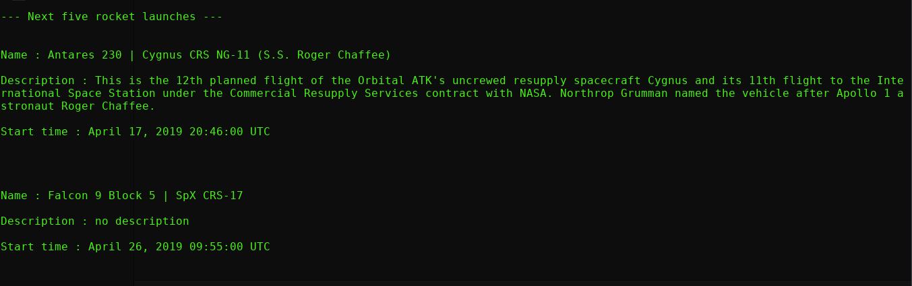

   

# Next fice rocket launches



## What's this software ?  

This python 3 software download and display the next five rocket launches.

This software is for aerospace enthusiast who do not want to miss a live rocket launch.

## How to launch this software :  

```sh
python3 RocketLaunch.py
```  

## Requirements :

Python 3

## Developer - Author

Hamdy Abou El Anein

## Homepage

http://www.daylightlinux.ch 
